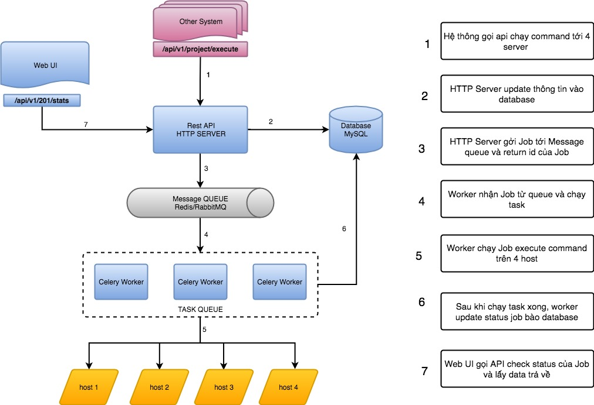
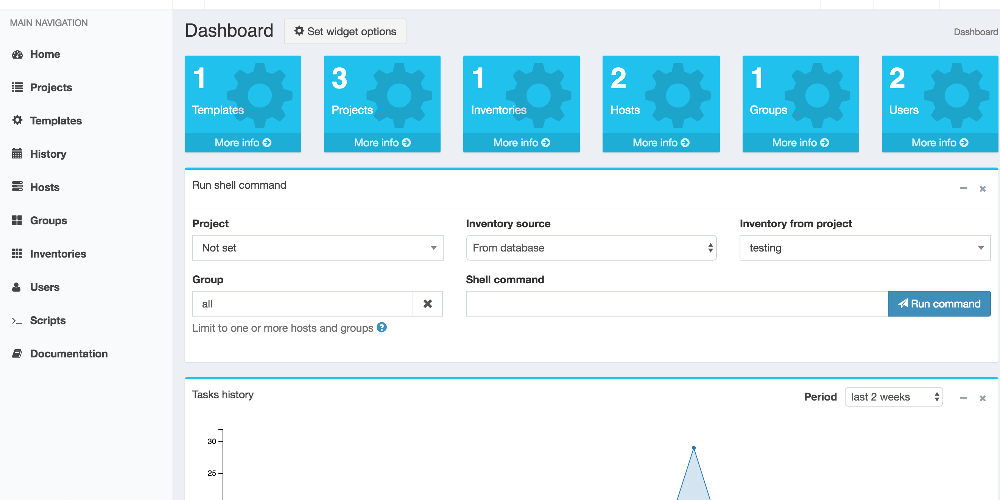
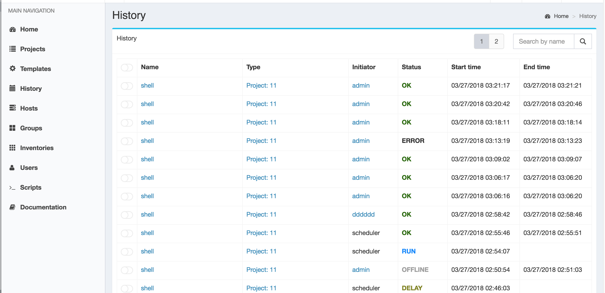
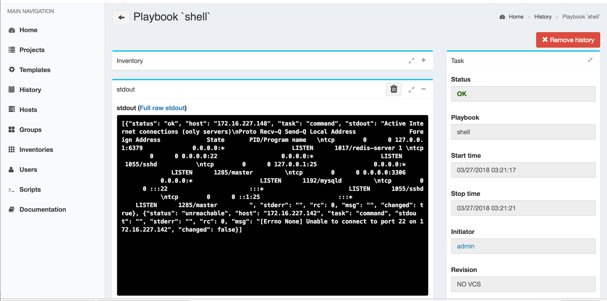

## ANSIBLE REST API

Công cụ này phát triển dựa trên công [https://github.com/vstconsulting/polemarch](https://github.com/vstconsulting/polemarch). Mình chỉ  viết thêm phần api mình có thể chạy exec command, playbook , script nhưng không chạy bằng ansible cli như tác giả  mà chạy bằng ansible python client.

- Hiện tại mình đã tích hợp xong và có thể chạy được 1 số API cần có thể gian để phát triển thêm

```
http://172.16.227.149/api/v1/projects/1/execute-module-api/
 {"inventory":"3","module":"shell","group":"abcd","args":"netstat -ntpl"}
```


-- Cấu trúc của tool --



-- **Các tính Năng** --

*Dashboard*:

Sẽ giống với bản gốc chưa sửa bất cứ ui nào ngoại trừ thêm tính năng chạy script



*History*:

Phần list sẽ giống



*Output Task*:

Sửa lại Output xuất ra theo kiểu JSON format debug để phù hợp tích hợp với các hệ thống khác



Sẽ phát triển tiếp mọi người hãy chờ nhé
